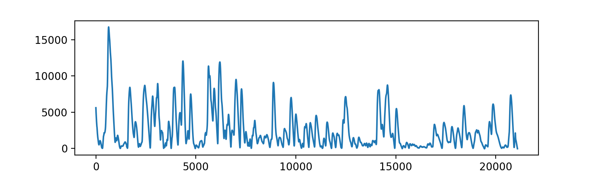

# Ledapy

Ledapy is a minimal port of Ledalab (www.ledalab.de) for Python. It runs in the command line and does not provide a GUI. However, it is suitable for integration with other packages, including [MIDAS](http://github.com/bwrc/midas/).

## Prerequisites

Ledapy requires Python 3 and the following packages

- numpy
- scipy
- sympy

Optionally, if one wants to plot

- matplotlib

## Usage

Ledapy is available on [PyPi](https://pypi.org). To install, run `pip3 install ledapy`.

There are some `.mat` files in this repository, provided so that Ledapy's results can be compared to Ledalab's (which can be run separately in Matlab).

A test run can be initated as follows

```
git clone https://github.com/HIIT/Ledapy.git
cd Ledapy
python3
```

```
import ledapy
import scipy.io as sio
from numpy import array as npa
filename = 'EDA1_long_100Hz.mat'
sampling_rate = 100
matdata = sio.loadmat(filename)
rawdata = npa(matdata['data']['conductance'][0][0][0], dtype='float64')
phasicdata = ledapy.runner.getResult(rawdata, 'phasicdata', sampling_rate, downsample=4, optimisation=2)
import matplotlib.pyplot as plt
plt.plot(phasicdata)
plt.show()
```

You should obtain something like this:



note that optimisation is performed automatically. To compare results with Ledalab, remember to press the ‘optimise’ button
